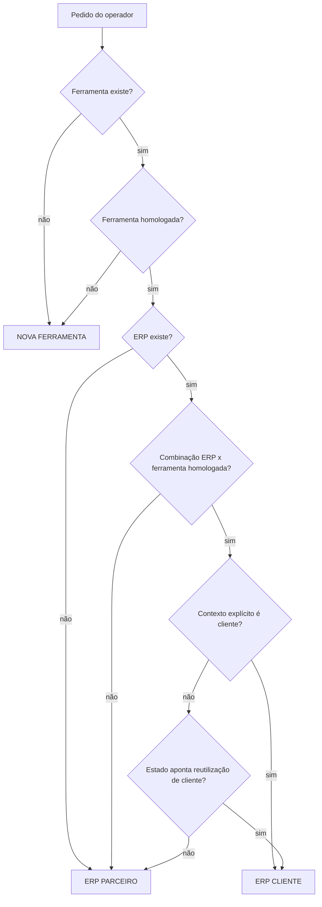

# Resolução de Contexto de Integração

## Propósito

Esta regra central define como a Fábrica resolve, antes de qualquer análise profunda de documentos fornecidos pelo operador, qual jornada deve ser usada para um cenário de integração.

Ela serve como camada normativa comum para as jornadas de:

- ERP parceiro;
- ERP cliente.

## Princípio de precedência

A estrutura homologada da Fábrica tem precedência operacional sobre documentos redundantes enviados pelo operador.

Primeiro a Fábrica consulta o próprio repositório, os estados persistidos e os manifestos vigentes para decidir o cenário. Somente depois ela usa documentos fornecidos pelo operador como contexto da execução corrente.

Se um documento recebido repetir algo que já está homologado, ele não vira nova verdade contratual.

## Decisões que a Fábrica deve resolver

Antes da decisao de jornada, a Fabrica deve determinar os estados minimos de identidade e elegibilidade:

- `ERP_CONHECIDO` (`SIM` | `NAO` | `IDENTIDADE_AMBIGUA`)
- `FERRAMENTA_CONHECIDA` (`SIM` | `NAO` | `IDENTIDADE_AMBIGUA`)
- `FERRAMENTA_HOMOLOGADA` (`SIM` | `NAO`)
- `COMBINACAO_ERP_FERRAMENTA_EXISTE` (`SIM` | `NAO`)

A normalizacao de identidade, tratamento de `IDENTIDADE_AMBIGUA`, reutilizacao de memoria, tratamento de fonte diferente/mudanca upstream e protecao contra sobrescrita cega seguem a regra oficial em `documentacao/11-MEMORIA-DE-ERPS-E-COMBINACOES.md`.

Ao receber um pedido simples de integração, a Fábrica deve responder, nesta ordem:

1. A ferramenta E-Catálogos existe na estrutura?
2. A ferramenta está homologada para integrações?
3. O ERP existe na estrutura?
4. O ERP já está homologado para aquela ferramenta?
5. A combinação ERP x ferramenta já está homologada?
6. O operador informou explicitamente se o cenário é de parceiro ou cliente?
7. Se não informou, qual jornada é compatível com o estado encontrado?

## Regra de resolução

### 1. Ferramenta não homologada

Direcionar primeiro para a jornada de nova ferramenta.

### 2. Ferramenta homologada + ERP novo

Direcionar para a jornada de ERP parceiro.

### 3. Ferramenta homologada + ERP existente, mas combinação ainda não homologada

Direcionar para a jornada de ERP parceiro, porque a unidade de homologação reutilizável é a combinação ERP x ferramenta.

### 4. Ferramenta homologada + ERP homologado para aquela ferramenta + contexto de cliente

Direcionar para a jornada de ERP cliente, reutilizando a integração homologada.

## Tratamento de documentos redundantes

Se a ferramenta já estiver `HOMOLOGADA_PARA_INTEGRACOES` e o operador também fornecer documentação da mesma ferramenta:

- não reinterprete a ferramenta;
- não sobrescreva o contrato homologado;
- não reexecute a homologação;
- não trate automaticamente o novo documento como nova verdade;
- informe que a ferramenta foi encontrada;
- informe que o documento recebido não é necessário para a execução corrente.

O mesmo princípio vale para ERP já homologado quando aplicável.

Documentos redundantes nunca devem ser apagados fisicamente só por serem redundantes. Eles podem ser relevantes futuramente em uma jornada explícita de atualização de contrato ou API.

## Identificação de parceiro e cliente

- Parceiro: cenário em que o ERP ou a combinação ERP x ferramenta ainda não está homologado para reutilização.
- Cliente: cenário em que a combinação ERP x ferramenta já está homologada e a tarefa é aplicar a integração existente ao ambiente real daquele cliente.

Se o operador não explicitar a intenção, a Fábrica deve usar o estado encontrado para escolher a jornada compatível.

## Credenciais

Credenciais fornecidas pelo operador são dados de runtime ou homologação.

Quando necessário e autorizado, a IA executora no workspace pode receber e usar credenciais reais para autenticação e chamadas de API. Isso não conflita com esta camada de resolução.

Devem ser tratadas apenas como conceito de execução:

- credenciais ERP: fornecidas;
- credenciais ferramenta: fornecidas.

Nesta camada, registre somente presença, nunca valores reais.

Usar credencial não é persistir credencial: não versionar segredos, não copiar tokens ou senhas para documentos versionados e não salvá-los em manifesto oficial.

Se o operador colar credencial diretamente na sessão da IA executora, o uso transitório para o objetivo autorizado é permitido, mas o valor não pode ser reproduzido nem persistido.

## Sequência vigente da jornada ERP parceiro

A jornada de ERP parceiro esta disponivel nos Passos 01 a 08 e prepara a base comercial de homologacao antes do desenvolvimento e da homologacao funcional da integracao.

Essa camada central não executa os passos. Ela apenas resolve o contexto e preserva a sequência oficial:

1. apresentar e identificar o ERP;
2. analisar as capacidades do ERP contra o contrato homologado da ferramenta;
3. projetar a homologação e a base necessária;
4. materializar a Base de Homologação no ERP;
5. projetar a integração e o mapeamento semântico;
6. desenvolver e testar localmente a implementação até `PRONTO_PARA_EXECUCAO_HML`;
7. executar e validar tecnicamente a implementacao em HML;
8. homologar funcionalmente a integracao em modelo manual assistido por IA.

O Passo 06 nao executa HML nem homologa funcionalmente a integracao. O Passo 07 executa HML controlada e pode liberar somente `PRONTO_PARA_HOMOLOGACAO_FUNCIONAL: SIM` depois de auditoria independente. O Passo 08 executa a homologacao funcional manual assistida por IA e pode liberar `INTEGRACAO_HOMOLOGADA: SIM` somente depois de auditoria independente aprovada. Publicacao, runtime e producao permanecem fora da sequencia vigente.

## Fluxo de decisão resumido

## Resultado esperado da resolução

A saída humana da camada deve ser objetiva e indicar:

- ferramenta encontrada ou não;
- ferramenta homologada ou não;
- ERP encontrado ou não;
- combinação homologada ou não;
- cenário resolvido;
- próxima jornada compatível;
- se um documento redundante foi recebido e por que ele não é necessário para esta execução.

Essa camada não executa jornada, não reinterpreta contratos homologados e não altera artefatos de negócio.

## Cenários validados

| Cenário | Situação                                                                            | Resolução                                                                     |
| ------- | ----------------------------------------------------------------------------------- | ----------------------------------------------------------------------------- |
| A       | Ferramenta nova + ERP novo                                                          | Nova ferramenta primeiro                                                      |
| B       | Ferramenta homologada + ERP novo                                                    | ERP parceiro                                                                  |
| C       | Ferramenta homologada + ERP conhecido, combinação ainda não homologada              | ERP parceiro para nova combinação                                             |
| D       | Ferramenta homologada + ERP homologado para ela + cliente                           | ERP cliente / reutilização                                                    |
| E       | Operador envia Swagger de ativo já homologado                                       | Documento redundante para a execução corrente, sem sobrescrever a homologação |
| F       | Operador envia nova documentação dizendo que a API mudou, mas não pediu atualização | Não alterar o contrato homologado automaticamente                             |

## Leitura operacional dos cenários

- A e B confirmam a precedência da jornada correta antes de qualquer consumo profundo de documentação.
- C confirma que a unidade de homologação reutilizável é a combinação ERP x ferramenta.
- D confirma que cliente reutiliza integração homologada, sem reconstrução.
- E e F confirmam que documentos redundantes ou atualizações não solicitadas não substituem o contrato homologado vigente.
